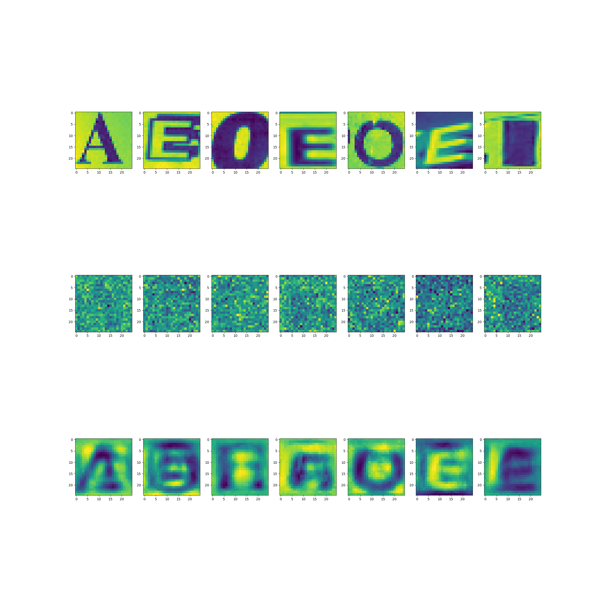

# Machine-Learning

## Questão 1
Considere o problema de classificação de padrões constituído de duas classes 
com os seguintes conjuntos de treinamentos:  
C 1 = {( 0 , 0 , 0 ), ( 1 , 0 , 0 ), ( 1 , 0 , 1 ), ( 1 , 1 , 0 )}  
C 2 = {( 0 , 0 , 1 ), ( 0 , 1 , 1 ), ( 0 , 1 , 0 ), ( 1 , 1 , 1 )}  
Determine o hiperplano de separação dos padrões considerando os seguintes métodos:  
a) Algoritmo do perceptron  
b) Máquina de Vetor de Suporte Linear.  

## Questão 2
Utilize redes neurais perceptrons de múltiplas camadas para aproximar as funções  
abaixo. Para o caso dos itens **b** e **c** e apresente para cada caso a curva da função  
analítica e a curva da função aproximada pela rede neural. Apresente também a curva  
do erro médio de treinamento com relação ao número de épocas e a curva do erro médio  
com o conjunto de validação. Procure definir para cada função a arquitetura da rede  
neural perceptron, isto é, o número de entradas, o número de neurônios em cada camada  
e o número de neurônios camada de saída.  
a) função lógica and  
b) f(x) = cos(2&pi;x)/(1-(4x)²)*sen(&pi;x)/(&pi;x) , 0<x≤4&pi;  
c) f(x,y) = x² + y² + 2xycos(&pi;xy) + x + y -1  

### 2.a Gráficos função logica

  
### 2.b f(x) = cos(2&pi;x)/(1-(4x)²)*sen(&pi;x)/(&pi;x)
%20loss)
%20MAE)
)
### 2.c f(x,y) = x² + y² + 2xycos(&pi;xy) + x + y -1  
%20loss)
%20MAE)
)

## Questão 3

## Questão 4
Considere o problema de reconhecimento de padrões constituído neste caso de uma  
deep learning, no caso uma rede convolutiva capaz de reconhecer os números:  
0, 1,2,3 ..., 9 , mesmo que estes tenham um pequeno giro de até 10 graus.  
Avalie o desempenho de sistema gerando a matriz de confusão. Pesquise  
as base de dados para serem usadas no treinamento  
### gráficos de convergência da rede convolutiva

### Matrix de confusão 

| nan     | 0     | 1             | 2      | 3     | 4     | 5     | 6     | 7     | 8   | 9     | 
|---------|-------|---------------|--------|-------|-------|-------|-------|-------|-------|-------| 
| **0**   | 972   |  0            |  4     |  0    |  1    |  1    |   0   |   0   |   1   |   1   | 
| **1**   |  0    |  1128         |  3     |  1    |  1    |  0    |   1   |   0   |   1   |   0   | 
|  **2**  |  2    | 1             |  1011  |  4    | 2     |  0    |   0   |   8   |  2    |   2   | 
| **3**   |  0    |  0            |  2     |  992  |  0    |  10   |   0   |   2   |   3   |   1   | 
| **4**   |  0    |  0            |  6     |  0    |  961  |  0    |   1   |   0   |   2   |  12   | 
|  **5**  |  1    |  0       |  1     |  0    |  888  |   1   |   0   |   1   |   0   |       | 
| **6**   |  8    |  3            |  1     |  0    |  2    |  10   |  928  |   0   |   6   |   0   | 
|  **7**  |  0    |  1            |  10    |  5    |  5    |  0    |   0   |  991  |   5   |  11   | 
| **8**   |  13   |  0            |  6     |  3    |  1    |  4    |   0   |   1   |  936  |  10   | 
| **9**   |  3    |  4            |  0     |  2    |  13   |  5    |   0   |   1   |  4    |  977  | 

*OBS:* A rede convolutiva conseguiu 97% de acurácia 

## Questão 5  
Um problema interessante para testar a capacidade de uma rede neural atuar como classificador de padrões  
é o problema das duas espirais intercaladas. A espiral 1 sendo uma classe e a espiral 2 sendo outra classe.  
Gere os exemplos de treinamento usando as seguintes equações:  
para espiral 1:  
x = &theta;/4 cos(&theta;), y = &theta;/4 sen(&theta;)       
para espiral 2:  
x = (&theta;+0.8)/4 cos(&theta;), y = (&theta;+0.8) sen(&theta;)  
fazendo &theta; assumir 100 igualmente espaçados valores entre 0 e 20 radianos. Solucione este
problema considerando:  
a-) Um rede perceptron de múltiplas camadas deep learning  
b-) Uma máquina de vetor de suporte (SVM)  
               
### Gráfico de convergência da  rede deep learning

### Função de decisão formada pela SVM

### Matrix de confusão
| nan | 0   | 1   | 
|-----|-----|-----| 
| 0   | 490 | 10  | 
| 1   | 10  | 490 | 

*OBS:* a deep learning conseguiu 100% de acurácia  
e a no-linear SVN conseguiu 98% de acurácia 

## Questão 6  
Utilize uma a NARX no caso uma rede neural perceptron de múltiplas camadas  
com realimentação para fazer a predição de um passo da série temporal:  
x(n) = sin(n + sin²(n)).  

Avalie o desempenho mostrando o erro de predição

## Questão 7
Considere dois sensores espacialmente distribuídos. Um sensor capta o sinal proveniente  
de uma fonte de sinal e o outro sensor é dirigido para captar o sinal o ruído proveniente  
de uma fonte de ruído indesejável. Os dois sensores captam um pouco de cada sinal.  
O objetivo é cancelar o ruído que é captado pelo sensor dirigido para fonte de sinal.  
Para modelar o problema considere as seguintes variáveis:  
s(n): sinal discreto emitido pela fonte de sinal dado por:  
s(n) = sen (0.075&pi;n)  
x(n): o sinal captado pelo sensor dirigido para captar o sinal da fonte dado por:  
x(n) = s(n) + v1(n)  
y(n): o sinal captado pelo sensor dirigido para captar o sinal de ruído:  
y(n) =v2(n) +0.05s(n)  
v1(n):ruído captado pelo sensor 1 dado por:  
v1(n) = -0.5v1(n-1)+v(n)  
v2(n): ruído captado pelo sensor 2 dado por:  
v2(n) = 0.8v2(n-1)+ v(n)  
v(n): um ruído branco uniformemente distribuído com média nula e variância unitária.  

Para remoção do ruído utilize um cancelador de ruído, isto é um sistema capaz de gerar o  
ruído recebido pelo sensor que capta o sinal de interesse. Para isto utilize o perceptron  
puramente linear treinado com o algoritmo LMS e em seguida uma rede perceptrons de  
múltiplas camadas treinada com o algoritmo da backpropagation. Nos dois casos considere  
como entrada os valores nos instantes n, n-1, n-2,n-3,n-4,n-5. Avalie o desempenho dos dois  
canceladores.  

## Questão 8
Considere o problema de reconhecimento de padrões constituído neste caso das vogais  
do alfabeto, utilizando para isto uma rede neural deep learning formada por um stacked  
de autoencoders. Represente as vogais através de matrizes de pixel binária. Teste a  
robustez do sistema para situações onde as vogais estão ruidosas e com pequenas rotações.  
Avalie o desempenho de sistema gerando a matriz de confusão 

 

   

### Matrix de Confunsão
| nan     | A   | E   | I   | O   | U  | 
|---------|-----|-----|-----|-----|----| 
| **A**   | 303 | 2   | 6   | 6   | 3  | 
| **E**   | 8   | 248 | 8   | 14  | 3  | 
| **I**   | 11  | 2   | 154 | 10  | 3  | 
| **O**   | 4   | 7   | 3   | 205 | 6  | 
| **U**   | 5   | 3   | 4   | 19  | 31 | 
